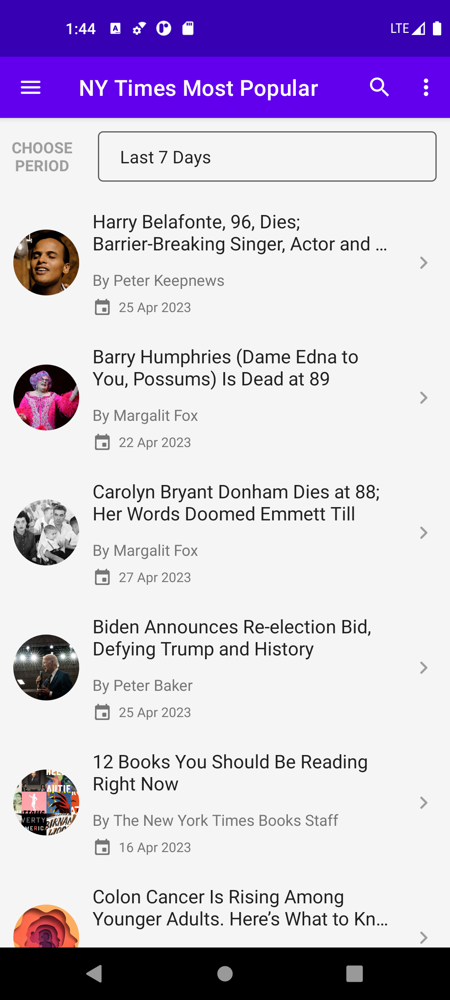
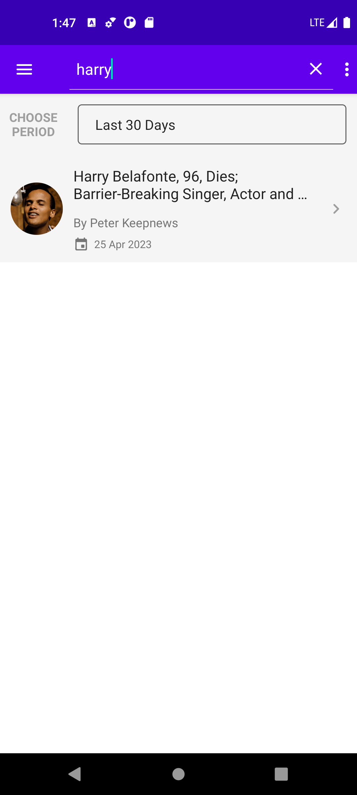
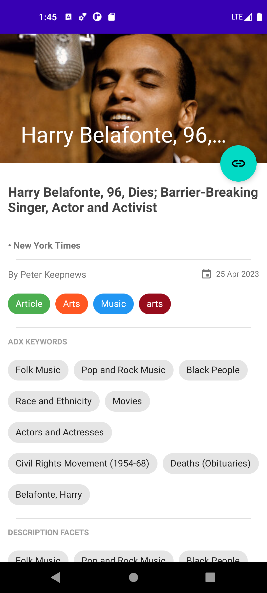
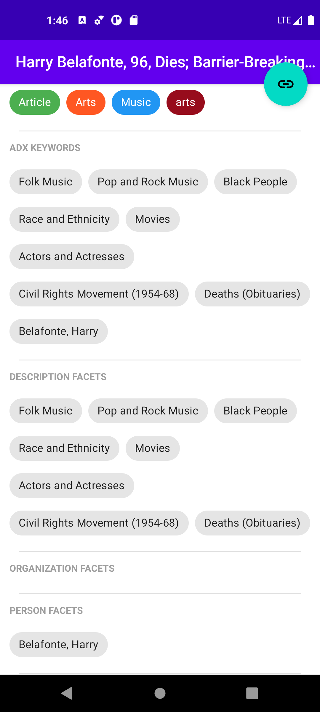
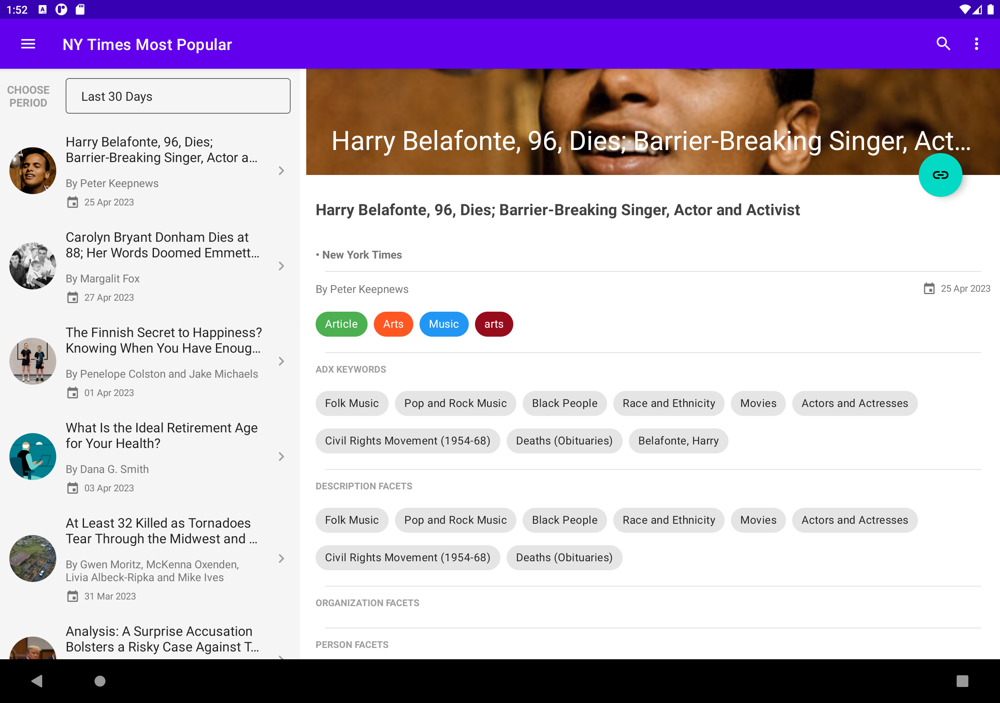

# ArticlesViewer
Simple articles viewer app that consumes **NY Times Most Popular API** to show the most viewed articles in the last 1/7/30 days.

## General
- This project is an example of how to impelement a clean architecture in android/ kotlin.
- **MVVM** architecture is followed along with **Repository** pattern.
- Data layer is composed of a single repository fetching its data from two data sources, local and remote data sources.
- UI layer is composed of:
    - A single activity containing two fragment, the first one is to display a list of articles, and the second one is to display a single article details.
    - A ViewModel for articles list fragment, and a ViewModel for article details fragment.
- This project is an **Offline-First** app. It supports both online and offline modes. It uses **Room Database** as a local storage and the main storage to read articles data, in which will be updated online using **Retrofit** whenever the network is available.
- This peoject supports **phone** and **tablet** sizes as Master/Details app.

## Used
- MVVM architecture pattern.
- Repository pattern.
- Dagger/Hilt Dependency Injection Framework.
- Retrofit.
- Room Database.
- NavigationUI.
- Kotlin Coroutines and Flows.
- XML
- JUnit Testing Framework.

## Project Structure
- **data**
    - **enums**
        - Status.kt (View State's possible statues [Idle, Success, Failure])
    - **models**
        - Article.kt
        - Media.kt
        - MediaMetaData.kt
    - DataResult.kt (Data class to hold the result of any local data transaction.)
    - NetworkResult.kt (Data class to hold the result of any network call.)
- **databases**
    - **dao**
        - ArticleDao.kt
        - BaseDao.kt
    - **entities**
        - ArticleEntity.kt
    - AppDatabase.kt
    - RoomTypeConverters.kt
- **datasources**
    - **local**
        - ArticleLocalDataSource.kt
    - **remote**
        - ArticleRemoteDataSource.kt
- **di**
    - AppModule.kt
- **network**
    - **responses**
        - ArticlesResponse.kt (api main response structure.)
        - ArticleResponse.kt (Api response article item templete)
    - ApiClient.kt
    - ApiInterface.kt
    - Interceptors.kt (includes AuthInterceptor to add api key to the network requests.)
- **repos**
    - ArticleRepository.kt
- **ui**
    - **activities**
        - HostActivity.kt
    - **adapters**
        - ArticlesRecyclerAdapter.kt
    - **fragments**
        - ArticleDetailsFragment.kt
        - ArticlesListFragment.kt
    - **states**
        - MainState.kt (main state of any view, hold by the viewmodel, uses Status.kt enum.)
- **utils**
    - Constants.kt (BASE_URL, API_KEY, DEFAULT_PERIOD, Navigation animation.)
    - Extensions.kt (kotlin extensions functions.)
    - Mapper.kt (Helper class to map objects to others.)
    - ResponseDelegate.kt (Responsible to handle network responses and map them to NetworkResult.kt)
- **viewmodels**
    - ArticlesViewModel.kt
    - ArticleViewModel.kt

## Installation
#### Android Studio IDE
Open Android Studio and select ```File -> New -> Project from Version Control...```,
and insert project url ```https://github.com/ghadeer-hammoud/ArticlesViewer```
#### Command Line
Clone this repository and import into Android Studio
```
git clone git@github.com:ghadeer-hammoud/ArticlesViewer.git
```

## Run
Connect an Android device to your development machine.
#### Android Studio
- Select ```Run -> Run 'app'``` (or ```Debug 'app'```) from the menu bar
- Select the device you wish to run the app on and click 'OK'

## Testing
#### Local Unit Test
Run the **test** task in terminal.
```./gradlew test```
The HTML test result files will be found in the following directory.
```path_to_project/module_name/build/reports/tests/ ```

#### Instrumented Unit Test
Connect a device or an emulator and run the **connectedAndroidTest** task in terminal.
```./gradlew connectedAndroidTest```
The HTML test result files will be found in the following directory.
```path_to_project/module_name/build/reports/androidTests/connected/ ```

## Screenshots





